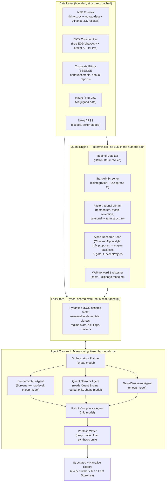

# ARTHA: From a General-Purpose Research Crew to a Niche Indian Markets & Commodities Intelligence System

**A diagnostic of your current CrewAI codebase, a literature-grounded redesign, and a directly buildable architecture for a Screener-style row-level + Harvey-style narrative + Medallion-style quant system, scoped first to NSE equities and MCX commodities.**

*Prepared after inspecting `multi-agent-clean.zip` (code, configs, and 20 real failed job logs) and a targeted literature review across multi-agent LLM trading frameworks, statistical arbitrage, hidden Markov regime detection, and LLM-driven alpha research.*

---

## How to read this document

1. **Part 1** is a forensic diagnosis of *why your current system fails* — not guesses, but conclusions drawn from your actual `config.py`, `research_crew.py`, and the 20 `*_error.json` files sitting in `data/Outputs/`.
2. **Part 2** is the literature grounding — the real papers and frameworks your new system should stand on, paraphrased and cited.
3. **Part 3** walks through the hypotheses I considered and rejected before landing on the final design, so the reasoning is auditable, not just the conclusion.
4. **Part 4** is the full architecture: data layer, quant engine, agent crew, model-routing/rate-limit strategy, reliability measures, evaluation framework, and a phased roadmap — scoped to **Indian equities (NSE) and commodities (MCX)** first, as you asked.
5. **Part 5** directly answers your two open questions: *should the quant model be its own pipeline or fused in?* and a note on the ISRO framing.

---

## PART 1 — Diagnosis: Why the Current System Actually Fails

I unzipped and read every file in `multi-agent-clean.zip`, not just the report you pasted. The pasted report describes the *intent* accurately, but the code and the 20 saved error logs tell a sharper story.

### 1.1 The smoking gun

Every single one of the 20 files in `data/Outputs/` is a `*_error.json`, and every one has the same root cause:

```
litellm.RateLimitError: RateLimitError: GroqException - {"error":{"message":"Rate limit reached for
model `llama-3.3-70b-versatile` in organization ... on tokens per minute (TPM):
Limit 12000, Used 10545, Requested 1838 ..."}}
```

Not one of the sampled jobs completed. This isn't bad luck — it's structural, and it comes from five compounding decisions in the code:

### 1.2 Root causes, in order of impact

**(a) The most expensive model is doing all four jobs.**
`config.py` defaults every agent — Planner, Researcher, Verifier, Writer — to `llama-3.3-70b-versatile`, which on Groq's free tier is one of the more token-constrained models (roughly 12,000 TPM, 100,000 TPD, per Groq's published limits as of mid-2026). Planning, and especially verification, don't need a 70B model; they need a model with a bigger daily quota. You're spending your scarcest resource (TPM) on tasks that don't need it.

**(b) The multi-key rotation doesn't do what the code assumes.**
`patched_completion()` cycles through comma-separated `GROQ_API_KEY` values on the theory that each key gets its own quota. Groq's rate-limit documentation is explicit that **limits are enforced at the organization level, not per API key** — multiple keys generated from the same account/org share one bucket. So the "Multi-Account Load Balancing" feature in your code is very likely burning through the *same* 12,000 TPM pool five times over with extra request overhead, not multiplying it. (If you do want genuinely separate quotas, that requires genuinely separate Groq accounts, which raises its own terms-of-service questions you should check directly with Groq rather than something I'd recommend engineering around.)

**(c) Sequential context-stacking multiplies token cost with every stage.**
`research_crew.py` runs `Process.sequential` across four agents, and `research_tasks.py` passes `context=[previous_task]` forward at each step. By the time the Writer agent runs, its prompt contains the Planner's full output *and* the Researcher's raw dump *and* the Verifier's assessment — all over again, on every retry. This is exactly the "telephone effect" that the TradingAgents paper calls out as the core failure mode of naive multi-agent chaining: conversations grow and re-transmit information the agent already has instead of querying it directly.

**(d) The truncation "fix" makes token usage worse, not better.**
When a prompt exceeds ~14,000 characters, the code slices the *longest single message* at a character boundary and appends a note. This is not semantic compression — it can cut a source's key finding mid-sentence, forces the model to spend tokens making sense of a broken fragment, and does nothing to stop the next stage from re-inheriting the same bloated context.

**(e) No caching, no partial persistence.**
Groq (and most providers) don't count cached prefix tokens against your TPM budget — but the system prompts here aren't structured to be cache-stable, so that saving is never claimed. And because `ResearchCrew.run()` only writes output on total success or total failure, a rate-limit error on the *Writer* step (after Planner + Researcher + Verifier already succeeded) throws away all three completed stages. You're not just failing individual calls — you're failing whole jobs and re-paying for work already done.

**(f) The scope is the real root problem.**
"Compare CrewAI and LangGraph," "impact of interest rate changes on the global housing market" — these are open-ended, unbounded-context research questions. No amount of rate-limit engineering fixes a system whose job is "read an unbounded slice of the internet and write an essay" on a 12,000-token-per-minute budget. This is why your instinct to **narrow the scope to a specific, structured domain** (Indian equities + commodities) is the correct move before any further engineering — it turns "read the whole internet" into "query a bounded, structured, mostly-numeric dataset," which is a completely different (and much cheaper) problem.

None of this means CrewAI or Groq are bad choices — it means the *shape* of the pipeline (one model size for everything, full-context sequential chaining, unbounded web research) is mismatched to both the free-tier constraints and the eventual finance use case. Part 4 redesigns around this.

---

## PART 2 — Literature Grounding

I did a targeted review rather than a broad one, aimed squarely at your stated goals: multi-agent LLM finance systems, the publicly-known Renaissance Technologies/Medallion approach, statistical arbitrage math, Harvey's domain-agent architecture, and LLM-driven quant research loops.

### 2.1 Multi-agent LLM trading frameworks

**TradingAgents** (Xiao et al., 2024, arXiv:2412.20138) is the closest published analogue to what you're building. It structures a trading desk as specialized LLM agents — fundamental, sentiment, and technical analysts feeding a Bull/Bear researcher debate, a trader who synthesizes the debate, and a risk-management team that has final veto power — rather than one agent trying to do everything. Two design choices from this paper are directly relevant to your rate-limit problem: it explicitly separates **fast, cheap models for retrieval/indicator calculation from deep, expensive models for debate and final decisions**, and it stores agent outputs in a **shared structured state** that later agents query directly instead of re-reading a growing transcript — precisely the fix your sequential context-stacking needs. It's also the paper that names the disease your architecture has: single-agent overload versus "naive chat-only coordination [that] loses information as conversations grow."

**FinRobot** (Yang et al., 2024, arXiv:2405.14767) organizes financial AI into four layers — a Financial AI Agents layer that decomposes problems via chain-of-thought, a Financial LLM Algorithms layer that swaps in domain-tuned or general models per task, an LLMOps/DataOps layer, and a foundation-models layer. The layering is a useful mental model for keeping your "data plumbing," "model selection," and "agent reasoning" concerns from tangling together the way they currently do in your `config.py`.

### 2.2 What's publicly known about Renaissance Technologies / Medallion

Renaissance's Medallion Fund is the highest-returning fund on record (widely reported at roughly 66% average annual returns before fees, 39% after fees, from 1988–2018), and its methods are deliberately secretive — nothing below is proprietary detail, only what's publicly documented about its intellectual lineage:

- Founders Robert Mercer and Peter Brown came from IBM's speech-recognition group, where they used **hidden Markov models (HMMs) and the Baum-Welch algorithm** — the same math used to model hidden "states" in a sequence of sounds — and brought that toolkit to markets to model hidden *regimes* in price behavior.
- The core edge attributed to Medallion is **statistical arbitrage and market-neutral mean reversion**: identifying pairs or baskets of related instruments (their own writings and public retrospectives mention things like gold–silver or heating-oil–crude-oil relationships) whose price relationship temporarily diverges, then betting on reversion — with **thin per-trade edges compounded across an enormous number of trades** rather than a few high-conviction bets. Robert Mercer has publicly said the fund was right only about 50.75% of the time; the edge comes from volume and discipline, not certainty.
- The fund's resilience during the 2007 "quant quake," when it briefly lost roughly 20% of its value in three days and then recovered to post an 85.9% return that year, is widely cited as evidence for **letting the mechanical model run instead of overriding it** — a discipline point, not a math point, but an important one for how much autonomy you give the system.

### 2.3 The academic backbone for a "Medallion-lite" quant engine

This is the peer-reviewed math underneath the RenTech-style approach, and it's directly implementable:

- **Avellaneda & Lee (2010), "Statistical Arbitrage in the US Equities Market"** is the foundational formalization of PCA-based statistical arbitrage: build a mean-reverting spread between correlated instruments, model that spread as an Ornstein-Uhlenbeck (OU) process, and trade its deviations from equilibrium via a z-score threshold.
- **Cointegration-based pairs trading** (going back to Engle & Granger's error-correction framework, and formalized for trading by Vidyamurthy) is the standard statistical test for whether two instruments share a genuine long-run equilibrium relationship worth trading, as opposed to a spurious correlation.
- **Regime-switching / hidden Markov models for statistical arbitrage** have direct commodities precedent: an OU-HMM framework for statistical arbitrage in international crude oil futures models the spread's mean-reversion speed, long-run mean, and volatility as *functions of a hidden regime* that has to be filtered from observed data — exactly the kind of model that would generalize to MCX crude, natural gas, or gold-silver spreads.

### 2.4 Harvey AI — the domain-agent template for the "row-level" layer

Harvey (legal AI for law firms) is architecturally instructive even though the domain is different, because your Screener-style ambition ("row-level commands and descriptive in-depth analysis" rather than raw numbers) is structurally the same problem Harvey solved for legal documents:

- Harvey's RAG stack sits on **specialized vector/structured databases** (LanceDB, Postgres+PGVector) across distinct corpora (user files, a long-term "Vault," and third-party legal databases) — the analogue for you is a structured fundamentals/price database, not a pile of scraped web pages.
- Harvey **decomposes evaluation into separate steps** — query rewriting, retrieval, generation, citation — and evaluates each independently. This is the discipline your "no fabricated skills or tools" preference already reflects in your resume work, applied to financial data: every number the Writer agent states must be traceable to a specific retrieved row, or it doesn't get written.
- Harvey's newer architecture explicitly moved to **"Tool Bundles"** — modular, composable capabilities with partial system-prompt control — instead of one monolithic orchestrator, to let multiple teams add capabilities without breaking each other. That maps directly onto your Data/Quant/Sentiment/Risk agent split in Part 4.

### 2.5 LLM-driven alpha research (the "quant model as a whole pipeline" question)

This is the most directly relevant recent research to your Medallion question, because it's literally about how to combine an LLM's reasoning with a deterministic quant backtester:

- **Chain-of-Alpha** (2025) uses a **dual-chain architecture**: a Factor Generation Chain proposes candidate alpha formulas in natural language/code, and a separate Factor Optimization Chain evaluates and refines them using backtest feedback — the LLM never just asserts a number is predictive, it proposes a testable formula that a deterministic backtester then scores.
- **AlphaAgent** (2025) adds explicit safeguards against "alpha decay" (factors that stop working once everyone finds them) by enforcing originality and complexity constraints before a factor is accepted, and reports large hit-ratio improvements from this hypothesis→construct→backtest→feedback loop.
- **Alpha-GPT 2.0** frames this as an "Alpha Mining Layer": an agent equipped with tools for computation, backtesting, and search-based enhancement, translating a human's natural-language market insight into a testable formula.

**The pattern across all of these is the same, and it's the answer to your integration question**: the LLM is a *hypothesis generator and narrator*, never the thing that computes or asserts a number. A deterministic, auditable engine (pandas/numpy/statsmodels/hmmlearn-class code) computes everything numeric and validates every hypothesis through backtesting; the LLM only ever reasons over the *results* of that engine. Part 4.3 and Part 5.1 build this out concretely.

### 2.6 Where Screener.in fits, and what you're adding to it

Screener.in's model is a structured query language over pre-computed financial ratios and a row-per-year table of fundamentals per company — powerful, but purely numeric, with no narrative synthesis. What you're describing is that same structured row-level rigor (no invented numbers, everything traceable to a specific reported figure) **plus** the Harvey-style narrative layer on top (explaining *why* a row-level change matters, in context) **plus** the TradingAgents-style multi-agent debate and risk framing **plus** a Medallion-style quantitative signal layer underneath. That's a legitimately novel combination — none of the individual pieces are new, but the specific synthesis, scoped to NSE + MCX, is not something I found an existing open-source project doing end-to-end.

---

## PART 3 — Design Hypotheses (and why I rejected two of them)

**H1 — "Just fix the rate limiting."**
Swap in a bigger free-tier model, fix the truncation, add real caching. Rejected as a final answer: it would reduce the *frequency* of failures but leaves the sequential context-stacking and unbounded-scope problems fully intact. It's a patch, not a redesign — though every individual fix from this hypothesis survives into Part 4's model-routing section, because they're free wins regardless of scope.

**H2 — "Clone TradingAgents wholesale."**
Directionally strong (it's the most relevant published system), but it's built for US equities with heavy news/social-sentiment inputs and doesn't have a stat-arb/quant-signal layer of its own — it relies on the LLM agents' reasoning over indicators, not a dedicated backtested signal engine. It also doesn't have Screener-style structured fundamentals depth or any Indian market data plumbing. Rejected as an as-is template, but its agent-role taxonomy and fast/deep model split are adopted directly.

**H3 — Chosen: two decoupled planes joined by a typed shared state, not a prompt chain.**
A **Quant Engine** (deterministic, no LLM in the numeric path: regime detection, statistical arbitrage screening, factor/signal library, walk-forward backtester) and an **Agent Crew** (LLM-powered retrieval, narration, debate, and risk framing) that never talks to itself through growing chat transcripts — instead, every agent reads and writes a small, typed **Fact Store**, and only the facts relevant to the current task are pulled into any given prompt. This directly resolves root causes (c) and (d) from Part 1, gives you a clean answer to "should the quant model be separate or integrated" (Part 5.1), and is exactly the shape the Harvey and TradingAgents architectures converge on independently.

---

## PART 4 — The Architecture: ARTHA (working name)

*("Artha" — one of the four Puruṣārthas in Indian philosophy, meaning wealth/means/purpose. Rename freely — this is a suggestion, not a requirement.)*

### 4.1 System diagram



### 4.2 Data layer — Indian equities and commodities, bounded and cached

| Need | Source | Notes |
|---|---|---|
| NSE historical OHLCV, bhavcopy, F&O | `jugaad-data` (Python, NSE + RBI) | Actively maintained, purpose-built for NSE; use for both stock and index history |
| NSE quick fallback / long-range history | `yfinance` with `.NS` suffix | Good redundancy source; slightly different symbol format, normalize at ingestion |
| MCX commodities EOD (gold, silver, crude, natural gas, base metals, agri) | MCX's own free **Bhavcopy** and **Historical Data** downloads | No paid subscription needed for EOD; sufficient for Phase 1–3 backtesting |
| MCX live / intraday | Broker APIs (Zerodha Kite Connect, Angel One SmartAPI) | Only needed once you reach live paper-trading (Phase 5); requires an active trading account with the broker |
| Corporate fundamentals (row-level, multi-year) | BSE/NSE filings + annual reports, structured into your own row-per-year schema | This *is* your Screener++ layer — build the table once, reuse everywhere |
| Macro context (repo rate, T-bill, deposit rates) | `jugaad-data`'s RBI module | Useful context for the Risk agent and for rate-sensitive sector narration |
| News (scoped) | Ticker-tagged RSS/news API queries, not open-web search | Keeps the Sentiment agent's context bounded to a handful of relevant headlines instead of unconstrained web search |

All of this is cached locally (Parquet/SQLite/Postgres) after first fetch — nothing is re-scraped per query, which is both a rate-limit and a politeness-to-data-sources consideration.

### 4.3 Quant Engine — deterministic, auditable, never LLM-generated numbers

This is the direct answer to your Medallion question, expanded in Part 5.1. Four modules:

**Regime Detector.** A hidden Markov model (via `hmmlearn`, using Baum-Welch for parameter estimation) fit on rolling return/volatility features per instrument or sector index, outputting a small number of discrete regimes (e.g., low-vol trending, high-vol mean-reverting, crisis). This is the direct, legitimate analogue of the HMM lineage described in Section 2.2 — publicly documented technique, not the proprietary specifics of any fund.

**Statistical Arbitrage Screener.** For NSE: cointegration testing (Engle-Granger or Johansen) across sector peers (e.g., private banks, IT majors, cement) to find genuinely mean-reverting pairs, not just correlated ones. For MCX: the same test applied to natural pairs — gold vs. silver, Brent-linked crude vs. natural gas, near-month vs. far-month contracts on the same commodity (calendar spreads) — with the spread modeled as an OU process per Avellaneda-Lee, and regime-conditioned per the OU-HMM commodities precedent in Section 2.3.

**Factor/Signal Library.** Momentum, mean-reversion, volatility-regime, and — specific to commodities — seasonality (agri commodities have real, recurring seasonal patterns tied to harvest cycles) and term-structure signals (contango vs. backwardation).

**Alpha Research Loop.** This is where the LLM and the quant engine actually meet, following the Chain-of-Alpha / AlphaAgent pattern: the LLM proposes a candidate signal in natural language ("does a 3-day RSI divergence combined with above-average volume predict next-week mean reversion in this sector?"), the engine translates that into a testable formula and runs it through the walk-forward backtester, and **only signals that clear a pre-set out-of-sample validation threshold are written into the Fact Store** as something the narrative agents are allowed to reference. Nothing enters the report because the LLM said it sounded plausible.

**Walk-forward Backtester.** Vectorized (e.g., `vectorbt` or a hand-rolled pandas backtester), with transaction costs and slippage assumptions realistic for Indian retail brokerage charges and MCX margin/lot-size mechanics — not a frictionless toy backtest.

### 4.4 The Fact Store — the fix for root causes (c) and (d)

Instead of passing growing prompt transcripts between agents, every agent reads/writes typed facts. A minimal sketch:

```python
from pydantic import BaseModel
from datetime import date

class FundamentalRow(BaseModel):
    symbol: str
    fiscal_year: int
    metric: str          # e.g. "operating_margin", "debt_to_equity"
    value: float
    source: str           # e.g. "NSE_ANNUAL_REPORT_2025_PG34"

class QuantSignal(BaseModel):
    symbol_or_pair: str
    signal_type: str       # "regime", "stat_arb_zscore", "momentum", ...
    value: float
    regime_label: str | None
    backtest_sharpe: float | None
    validated: bool         # only True if it cleared the walk-forward gate
    as_of: date

class RiskFlag(BaseModel):
    symbol_or_pair: str
    flag_type: str          # "concentration", "drawdown_breach", "circuit_limit"
    detail: str
    severity: str           # "info" | "warning" | "block"

class NewsSignal(BaseModel):
    symbol_or_commodity: str
    headline_count: int
    sentiment_score: float    # from a local FinBERT pass, not an LLM call
    event_type: str | None    # "earnings", "corporate_action", "policy", "supply_shock", ...
    as_of: date
    source: str
```

The Writer agent's prompt only ever contains the *specific* `FundamentalRow` / `QuantSignal` / `RiskFlag` objects relevant to the current report — not the entire research history. This alone eliminates most of the token bloat from Part 1.2(c).

### 4.5 Agent Crew — redesigned roles

| Agent | Model tier | Job | Reads | Writes |
|---|---|---|---|---|
| Orchestrator/Planner | cheap (8B-class) | Decomposes the query into which data slices, quant signals, and risk checks are needed | user query | task plan (Fact Store) |
| Fundamentals Agent ("Screener++") | cheap | Retrieves row-level structured fundamentals, writes the descriptive delta narrative Screener doesn't provide | fundamentals DB | `FundamentalRow`-grounded narrative |
| Quant Narrator Agent | cheap | Reads Quant Engine outputs and explains regime state / stat-arb candidates in plain language — **never computes anything itself** | `QuantSignal` | narrative referencing signal IDs |
| News/Sentiment Agent | cheap | Summarizes a small, ticker-scoped set of recent headlines | scoped news feed | sentiment facts |
| Risk & Compliance Agent | mid-tier | Position-sizing sanity checks, drawdown/concentration flags, circuit-limit awareness (replaces the old generic "Verifier") | all facts so far | `RiskFlag` |
| Portfolio Writer | deep model, final synthesis only | Produces the final structured + narrative report, optionally staging a brief Bull/Bear debate for conviction calibration (TradingAgents-style) | all Fact Store entries for this job | final report |

Only the **Writer** ever needs the expensive model, and only once per job — this is the single biggest rate-limit win available, independent of anything else in this document.

### 4.6 Model routing and rate-limit strategy (fixes for Part 1's root causes)

1. **Tiered routing by task, not by system default.** Retrieval, extraction, classification, and row-level narration go to a high-daily-quota, small model (Groq's `llama-3.1-8b-instant` class, or an equivalent Gemini Flash tier). Only the final Writer synthesis and any Bull/Bear debate use a larger model. This mirrors TradingAgents' explicit fast/deep split.
2. **Real caching.** Keep system prompts and tool schemas byte-identical across calls and place them first in the message list — cached prefix tokens don't count against Groq's TPM limit, so this is free headroom you're currently not claiming.
3. **Honest multi-provider failover, not fake multi-key rotation.** Route through LiteLLM (which you already depend on) with a real fallback chain: Groq (primary, fastest) → Gemini (secondary) → an optional self-hosted quantized model via Ollama (tertiary, zero rate limit, useful for development and for the highest-volume cheap tasks). Drop the comma-separated-key trick — it isn't buying you what the code assumes, per Section 1.2(b).
4. **Per-stage checkpointing.** Persist each agent's output to the Fact Store immediately, not just at total job success/failure. A rate-limit error during the Writer stage should resume from the Writer stage on retry, not re-run the whole pipeline.
5. **Semantic, not character-level, compression.** If a tool result genuinely needs shortening, summarize it with the cheap model into a structured fact first — don't slice raw text at a character count.

### 4.7 Reliability / failure-mode table

| Failure mode | Mitigation |
|---|---|
| Provider rate limit hit mid-job | Per-stage checkpointing + automatic failover to next provider in the LiteLLM chain |
| Data source (NSE/MCX site) temporarily unreachable | Local cache-first reads; nightly batch refresh instead of per-query live fetch |
| Cointegration/regime model overfits to a spurious historical relationship | Mandatory walk-forward out-of-sample gate before any signal is `validated=True` and eligible for narration |
| LLM narrator states a number not backed by a Fact Store entry | Post-generation citation check: every numeric claim in the Writer's output must resolve to a Fact Store key, or the report is rejected and regenerated |
| Sudden regime shift breaks a previously-valid stat-arb pair | Regime Detector output is a required input to the Stat-Arb Screener — signals are regime-conditioned, not static |
| Broker API downtime (once in Phase 5 live-signal territory) | Read-only signal generation continues from bhavcopy EOD data even if the live broker feed is down; no autonomous order placement regardless |

### 4.8 Evaluation framework

Borrowing Harvey's decomposed-evaluation discipline and TradingAgents' financial metrics:

- **Retrieval/traceability accuracy** — % of narrative claims that resolve to a real Fact Store citation (target: 100%; this is a hard gate, not a soft metric).
- **Signal quality** — information coefficient (IC) and hit-rate of each accepted factor on out-of-sample walk-forward windows, plus Sharpe/Sortino/max-drawdown of any resulting backtested strategy.
- **Cost/latency per report** — tokens and wall-clock time per job, tracked per agent role, to verify the tiered-model strategy is actually reducing spend.
- **Regime robustness** — does a signal's performance hold up when tested across at least two different market regimes, not just the training window's dominant one.

### 4.9 Phased roadmap (Indian markets + commodities first, as you specified)

**Phase 1 — Screener++ (row-level descriptive engine).** NSE large/mid-cap fundamentals, structured row-per-year schema, Fundamentals Agent + Writer only. No quant signals yet. Goal: prove the traceable-narrative pattern works and is cheap to run.

**Phase 2 — Quant Engine v1.** Regime Detector + Stat-Arb Screener for NSE sector peers, fully backtested, surfaced as read-only "signals to be aware of" — not trading instructions.

**Phase 3 — Commodities extension (MCX).** Gold-silver ratio, crude-natural gas and calendar spreads, agri seasonality, using the OU-HMM approach from Section 2.3. This is the first point where the "commodities" half of your ask is fully live.

**Phase 4 — Alpha Research Loop.** Chain-of-Alpha-style automated factor proposal and backtesting, with a human-in-the-loop approval gate before any newly-discovered factor is trusted in production narration.

**Phase 5 — Paper-trading validation.** Broker API integration (Kite Connect / Angel One SmartAPI) for live signal tracking against real market conditions. Kept deliberately at **paper-trading / read-only signal validation** first. As of this writing, SEBI's retail algo-trading framework (fully enforced from April 1, 2026) is the operating reality for this phase — see Part 6.5 for what it concretely requires before any personal-account order placement.

### 4.10 Tech stack summary

| Layer | Tooling |
|---|---|
| Data ingestion | `jugaad-data`, `yfinance`, MCX bhavcopy downloads, `httpx` |
| Storage | Parquet for time series, Postgres (or SQLite for prototyping) for fundamentals/Fact Store |
| Quant engine | `pandas`, `numpy`, `statsmodels` (cointegration/OLS), `hmmlearn` (regime HMM), `vectorbt` or custom vectorized backtester |
| Agent orchestration | CrewAI (kept, but re-architected around the Fact Store instead of sequential context passing) or a hierarchical process if you want a manager-agent pattern |
| LLM routing | LiteLLM, tiered Groq (8B for cheap tasks) → Gemini Flash → local Ollama fallback |
| API layer | FastAPI (kept from current system) |
| Frontend | Kept — SPA with progress streaming, now streaming per-agent Fact Store writes instead of raw transcript text |

### 4.11 Suggested repo structure

```
artha/
  app/
    data/
      nse.py            # jugaad-data + yfinance wrappers, caching
      mcx.py             # bhavcopy ingestion, symbol normalization
      fundamentals.py    # row-level schema builder (Screener++)
    quant/
      regime.py          # HMM regime detector
      statarb.py         # cointegration screener + OU spread fit
      factors.py          # factor/signal library
      alpha_loop.py       # Chain-of-Alpha-style propose->backtest->gate
      backtest.py         # walk-forward vectorized backtester
    factstore/
      schemas.py          # Pydantic models (FundamentalRow, QuantSignal, RiskFlag)
      store.py            # read/write interface (Postgres or SQLite)
    agents/
      orchestrator.py
      fundamentals_agent.py
      quant_narrator_agent.py
      sentiment_agent.py
      risk_agent.py
      writer_agent.py
    llm/
      router.py           # tiered LiteLLM config, caching, failover chain
    api/
      routes.py
    main.py
  tests/
    test_statarb.py
    test_regime.py
    test_factstore_citations.py   # enforces the traceability gate
  data_cache/
  frontend/
```

---

## PART 5 — Direct Answers

### 5.1 "Should the quant model be its own pipeline, or integrated?"

**Its own pipeline, integrated only through the Fact Store and tool calls — never fused into the LLM's own reasoning path.** Every LLM-driven alpha-research paper reviewed in Section 2.5 converges on this same split: the LLM is excellent at *proposing* hypotheses in natural language and *narrating* results, and unreliable at *computing or asserting* numbers. A deterministic engine (the one in Part 4.3) computes and validates everything numeric; the LLM only ever reads validated `QuantSignal` objects out of the Fact Store. This gives you three concrete benefits: (1) you can unit-test and backtest the quant engine completely independently of any LLM, the same way you'd test any other codebase; (2) nothing reaches the final report unless it cleared a walk-forward validation gate, which is your actual defense against hallucinated "insights"; (3) it's the only way to make the Medallion-style discipline in Section 2.2 — mechanical, unemotional, high-volume, thin-edge — actually mean something, since an LLM narrating its own invented numbers is the opposite of that discipline.

### 5.2 On the ISRO framing

One honest note: this system is a financial-markets intelligence tool, not an aerospace or remote-sensing system, so "directly implementable by ISRO" doesn't quite apply here the way it would for a satellite-imagery project like your Bharatiya Antariksh Hackathon work. I've held this document to the same production-grade bar — cited methodology, auditable data lineage, no fabricated numbers, explicit failure-mode handling — but I wanted to flag the mismatch rather than silently force an ISRO angle onto a stock-market system.

---

---

## PART 6 — Follow-up: News Signal Module, Where Simulation Lives, and a Reality Check on Returns

### 6.1 The News/Sentiment module, in scope and concretely specified

Yes — this fits cleanly into the existing design, and it should be built so it costs almost nothing in tokens.

**Sources**, ticker/commodity-scoped (never open-web search): NSE/BSE corporate announcements feeds, a small curated set of financial news RSS feeds, and — for commodities — supply-side news (OPEC/EIA statements for crude, monsoon/harvest reports for agri, RBI/MCX circulars for bullion). Scoping to a fixed set of sources per instrument is what keeps this cheap and keeps the Sentiment Agent's context small.

**Processing — do this without spending LLM tokens.** Run **FinBERT** (a BERT variant fine-tuned specifically on financial text) locally, for free, as a classification pass over each headline — this is not a chat completion, it's a small transformer inference call you can run on a laptop CPU in milliseconds. A 2026 study applying FinBERT-derived sentiment specifically to NIFTY 50 stocks — combined with retrieval-augmented generation and a reinforcement-learning refinement loop — found the sentiment features held up well across different market regimes and improved predictive stability, which is direct Indian-market precedent for this exact design. Only the *narration* of what the sentiment means (not the scoring itself) should ever touch your Groq/Gemini quota, and only for a handful of already-summarized `NewsSignal` facts, not raw headlines.

**Output**: the `NewsSignal` fact type added to the Fact Store schema in Part 4.4 — sentiment score, headline volume, and a coarse event-type tag (earnings, corporate action, policy, supply shock). This feeds two places: the Quant Engine's factor library (news sentiment as one more feature the regime/RL layer can condition on — see 6.4) and the Sentiment Agent's narration for the final report. It is never allowed to *directly* trigger a trade signal on its own; it's context, not a standalone strategy, consistent with the Risk Agent's veto authority elsewhere in this design.

### 6.2 Where does "simulated market analysis" actually live?

Short answer: **build it into ARTHA itself as a historical-replay + walk-forward engine — you don't need to load the model onto a separate platform, and there isn't a free official one to load it onto anyway.**

One thing worth correcting directly: Zerodha's own Kite Connect FAQ states plainly that **Zerodha does not offer a sandbox environment for Kite Connect.** There is no official free "paper trading" broker sandbox to plug into. What people call "paper trading" in the Indian retail-algo context is usually one of two things you build yourself:

1. **Historical replay simulation (free, do this first).** Feed the pipeline historical bhavcopy/EOD data day-by-day as though it were arriving live, and let the Quant Engine and Fact Store operate exactly as they would in production. This is just the walk-forward backtester from Part 4.3, run in "replay" mode rather than "evaluate the whole history at once" mode — the same code path, which is good engineering hygiene (you're testing the actual system, not a separate toy backtest). This costs nothing beyond your own compute.
2. **Live paper-trading against a real-time feed (costs money, do this only after step 1 looks good).** This requires a live market data connection, which in India generally means a broker API subscription — Kite Connect is a paid subscription (Zerodha's own pricing has historically been in the ~₹2,000/month range for API access; confirm current pricing directly, as broker pricing changes). At that point you're running the live system with real-time data but withholding actual order placement — genuinely simulating, not backtesting.

Given your "not extensive money put in yet" constraint, the right sequencing is: validate everything through free historical replay and walk-forward backtesting (Phases 1–4 in Part 4.9), and only pay for a broker API once you're ready for Phase 5's live signal validation — which is exactly the point at which you said you'd be open to spending.

### 6.3 A direct, honest look at "35–40% profit" and "lakhs of trades a day"

I'd rather tell you the calibrated truth here than an encouraging number that doesn't hold up.

**On trade frequency**: Medallion's "hundreds of thousands of trades a day" figure describes an entire firm running many strategies across thousands of instruments simultaneously on proprietary, co-located, sub-millisecond infrastructure — it is not the frequency of any single strategy, and it is not something that transfers to a retail account regardless of how good the model is, because it requires exchange co-location and infrastructure spend that has nothing to do with signal quality. For what it's worth, this also isn't a constraint you need to fight: SEBI's April 2026 framework sets its retail/personal-use threshold at 10 orders *per second* (see 6.6) — a diversified portfolio of NSE sector pairs and MCX commodity spreads generating anywhere from a few dozen to a few hundred trades a day is a completely legitimate, SEBI-compliant, capstone-appropriate instantiation of "many trades, thin edges, compounded," and it stays nowhere near that ceiling.

**On the 35–40% target**: I want to be straightforward rather than falsely encouraging. Medallion's ~66% gross / ~39% net figures came from a specific three-decade window, enormous leverage, and infrastructure/data advantages built over decades — they are not a reproducible target for a retail-scale system, and I'd be doing you a disservice if I nodded along and engineered toward that number as a goal. What the published academic literature on statistical arbitrage actually shows is more modest and more trustworthy: one well-documented market-neutral stat-arb basket strategy, tested over roughly a decade, achieved around 19% annualized return at a Sharpe ratio of about 1.6 with a 15% maximum drawdown — and a Sharpe ratio above 1.0 is generally considered solid, above 2.0 very good. That's the realistic bar a validated NSE/MCX stat-arb-plus-regime system should be aiming to clear, not 35–40%.

More importantly, **treating a specific return number as the target you engineer toward is itself a known failure mode** — it's exactly how strategies get overfit to hit a number in backtesting and then fail in live markets, because a genuinely robust strategy that reliably delivers a modest, repeatable edge is worth far more than an eye-catching backtest number that collapses the moment real costs and a new market regime show up. The healthier design goal, and the one this architecture is built around, is: **maximize risk-adjusted return (Sharpe/Sortino) and control drawdown, and let the realized CAGR be whatever a genuinely validated, walk-forward-robust process produces.** If the system finds real, compounding inefficiencies across NSE sector pairs and MCX commodity spreads, it's entirely plausible to beat index returns meaningfully over time — but that's a conclusion to earn from the walk-forward evaluation in Part 4.8, not a number to promise up front. I'm not a financial advisor and this isn't investment advice; treat the above as methodology, not a forecast.

### 6.4 Making the regime model adaptive: two distinct mechanisms, not one

"A reinforcement loop for the HMM" is actually two separate, both-legitimate things, and it's worth being precise about which is which so the engineering doesn't end up incoherent:

**(a) Keeping the HMM's own parameters current — online/recursive re-estimation, not RL.** The standard Baum-Welch algorithm re-estimates HMM parameters in a batch, over the whole history at once, which is both computationally expensive and blind to the fact that market dynamics genuinely change over time — published work on crude oil price modeling with HMMs notes explicitly that financial time series don't have fixed parameters, so the model has to be retrained periodically for live use. The fix is a **recursive/online EM variant** (linear cost per new observation, versus the quadratic cost of full batch re-estimation), so the regime model keeps quietly re-calibrating itself as new NSE/MCX data arrives, rather than going stale between manual retrains.

**(b) An RL layer wrapped around the regime output — this is the actual "reinforcement loop."** A hidden Markov model isn't trained by reinforcement learning — it's trained by expectation-maximization on likelihood — but you can put a genuine RL policy *on top* of it: treat the current regime label (plus other Fact Store signals — stat-arb z-score, volatility, the news sentiment from 6.1) as the state, treat position-sizing/strategy-selection decisions as the action space, and let the policy learn from realized reward (risk-adjusted P&L) which actions work best in which regimes. This is not hypothetical — a May 2026 paper on regime-based portfolio allocation combining HMMs with reinforcement learning found that the RL-augmented policy delivered the strongest Sharpe ratio and materially lower drawdowns versus HMM-only allocation, while remaining fully interpretable because the underlying regimes stay discrete and explainable. That's the right shape for "more robust with passing time": the HMM tells you *what regime you're in*, and the RL layer gets better over time at knowing *what to do about it*, based on real outcomes rather than a fixed rulebook.

### 6.5 Making the whole system robust to outliers

Financial return data is genuinely heavy-tailed — real market moves, not just data errors, routinely fall well outside what a Gaussian model expects — so "foolproof to outliers" has to mean two different things handled two different ways:

- **Genuine bad data (fat-finger prints, feed glitches) should be caught and discarded at ingestion.** Use robust scale estimators — median absolute deviation (MAD) rather than mean/standard-deviation — to flag ingested ticks that are statistically implausible before they ever reach the Quant Engine.
- **Genuine large market moves (circuit-limit hits, real news shocks) should never be scrubbed — they're exactly the signal the Regime Detector needs to see.** Concretely: (1) use **MAD-based robust z-scores** rather than mean/std-based ones for stat-arb entry/exit thresholds, so a handful of extreme days don't distort the whole threshold; (2) model spread residuals with a **Student-t distribution instead of Gaussian** in the OU process from Part 4.3, since Student-t explicitly accounts for the heavy tails real spread data has; (3) use a **robust (Student-t-emission) variant of HMM/Kalman filtering** rather than the standard Gaussian-emission version, a documented approach for exactly this kind of heavy-tailed measurement noise in state-space models; and (4) treat NSE circuit-breaker halts as their own explicit state rather than as missing or anomalous data, since a halt is information, not noise.

### 6.6 The concrete SEBI 2026 compliance picture for Phase 5

This has changed since my training data and is worth stating precisely rather than vaguely, since it directly shapes what Phase 5 looks like: SEBI's retail algorithmic-trading framework became **fully mandatory for all brokers from April 1, 2026**. The practical implications for a personal-use system like this one:

- If your own script places orders at **fewer than 10 orders per second**, you're treated as a regular API user and can operate under a broker-assigned **Generic Algo-ID** rather than going through full strategy registration as a SEBI Research Analyst — the RA-registration burden applies to people *selling* black-box strategies to others, not to someone running their own transparent ("white box") logic on their own account.
- API orders now require a **registered static IP** whitelisted with your broker, daily two-factor re-authentication, and every order carries the exchange-assigned Algo-ID for traceability.
- This is a genuinely current, actively-enforced framework as of today, not a proposal — worth confirming the specifics directly with your broker's API documentation before Phase 5, since operational details (which broker, which endpoints, exact OPS accounting) are the kind of detail that's safest to verify at the source rather than take from any single secondary summary, including this one.

---

## References (paraphrased throughout; consult directly for full detail)

- Xiao, Y. et al. *TradingAgents: Multi-Agents LLM Financial Trading Framework.* arXiv:2412.20138. https://arxiv.org/abs/2412.20138
- Yang, H. et al. *FinRobot: An Open-Source AI Agent Platform for Financial Applications using Large Language Models.* arXiv:2405.14767. https://arxiv.org/abs/2405.14767
- Avellaneda, M. & Lee, J.-H. (2010). *Statistical Arbitrage in the US Equities Market.* Quantitative Finance, 10(7).
- OU-HMM statistical arbitrage in crude oil futures. arXiv:2309.00875. https://arxiv.org/pdf/2309.00875
- *Chain-of-Alpha: Unleashing the Power of Large Language Models for Alpha Mining in Quantitative Trading.* arXiv:2508.06312.
- *AlphaAgent: LLM-Driven Alpha Mining with Regularized Exploration to Counteract Alpha Decay.* arXiv:2502.16789.
- *Alpha-GPT 2.0: Human-in-the-Loop AI for Quantitative Investment.* arXiv:2402.09746.
- Harvey AI architecture case studies (ZenML LLMOps Database): agent-based scaling, enterprise RAG systems, domain-expert evaluation. https://www.zenml.io/llmops-database/
- Renaissance Technologies / Medallion Fund public retrospectives (Quartr, QuantVPS, Day-to-Data, various) — used only for publicly-known strategic lineage (HMMs, statistical arbitrage, market-neutral discipline), not proprietary detail.
- `jugaad-data` (NSE/RBI Python library). https://github.com/jugaad-py/jugaad-data
- MCX India — official Bhavcopy and Historical Data pages. https://www.mcxindia.com/market-data/
- Groq rate-limit documentation and third-party 2026 summaries (org-level enforcement, RPM/TPM/RPD structure). https://console.groq.com/docs/rate-limits
- Verma, A.K. et al. *Regime-Based Portfolio Allocation Using Hidden Markov Models and Reinforcement Learning.* arXiv:2605.27848 (May 2026).
- *Adaptive Financial Sentiment Analysis for NIFTY 50 via Instruction-Tuned LLMs, RAG and Reinforcement Learning Approaches.* arXiv:2512.20082.
- Araci, D. (2019). *FinBERT: Financial Sentiment Analysis with Pre-trained Language Models.* arXiv:1908.10063.
- Recursive/online EM estimation for HMM parameters (linear-cost alternative to batch Baum-Welch). ResearchGate: "Recursive estimation of multivariate hidden Markov model parameters."
- Robust Student-t / Interacting Multiple Model filtering for heavy-tailed measurement noise. PMC: "Robust Interacting Multiple Model Filter Based on Student's t-Distribution."
- Robust scale estimators (MAD, Winsorization) for outlier detection — general robust-statistics literature (Hampel et al., *Robust Statistics: The Approach Based on Influence Functions*).
- A Markowitz Approach to Managing a Dynamic Basket of Moving-Band Statistical Arbitrages. arXiv:2412.02660 — cited for realistic stat-arb performance benchmarking (~19% annualized return, Sharpe ~1.61).
- Zerodha Kite Connect API — official FAQ (confirms no sandbox environment) and pricing pages. https://support.zerodha.com / https://zerodha.com/products/api/
- SEBI circular SEBI/HO/MIRSD/MIRSD-PoD/P/2025/0000013 (Feb 4, 2025) on "Safer participation of retail investors in Algorithmic trading," and 2026 implementation summaries confirming April 1, 2026 full enforcement, the 10 orders/second retail threshold, and static-IP/Algo-ID requirements.
